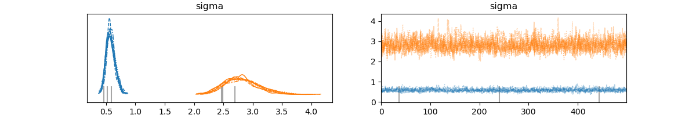
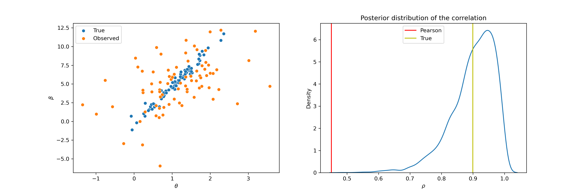

# Bayesian measurement error models for correlation estimation

This project is a Python adaptation of an advanced correlation measurement error model originally developed  by Behseta et al. (2009) and later implemented in R/WinBUGS by Matzke et al. (2017). Leveraging the open-source code and simulated dataset provided by Matzke et al.        [available at OSF](https://osf.io/mvz29/), this model has been recreated using the modern and advanced Stan probabilistic programming language (Carpenter et al. 2017).

## File structure
- README.md 
    - The file your reading right now.
- Hierachial_correlation_measurement_error.stan
    - Jupyter notebook containing the python code for the analsysis of the dataset. 
- stan
    - measure_cor_error.stan: Stan file with the code for the probalitic programme to generate measurement error model for correlation estiamtion udner measurement error.
- vis 
  - equations.png: PNG file of latex equation for the measurement error model.
  - estimates.png: PNG file of model estimates and shrinkage due to proper measurment error control.
  - mu_trace_divergences.png: PNG file from the model presciption that generates divergeneces.
  - sigma_trace_divergences.png PNG file from the model presciption that generates divergeneces.
  - rho_ppc.png: PNG fro rho parameter that doesnt have divergences udner the model prescription.

## Stan
[Stan](https://mc-stan.org/) is the state-of-the-art platform for statistical modeling and high-performance statistical computation pioneering many of the modern probabilstic modelling methods and tools that this example demonstrates. These include non-centered parametrisations, LKJ priors and the Algorithms shouting at you when something goes wrong (specificaly here model divergences) (McElreath, 2020).  

## Measurement error model (Stanified)

  

## Posterior predictive checks

Fig 2: Posterior and trace plots for crtical model parameters

The plots for the sigma and mu parameters show the model under assumptions presented in the equations above. Fitting this exact model results in some divergences. An exercise for the reader is to observe that increasing the LKJ prior value to $\geq 2$ removes these divergences, suggesting that with this data and the complexity of such a model, some greater constraining of the parameters is needed for proper model fitting.

## Plot reproduction

Fig 1.

Overall, the model achieves the goal of producing shrinkage such that what are labeled as the true estimates in Fig 1 are less uncertain with less variability, producing a much higher $\rho$ correlation coefficient when compared to standard Pearson correlation estimates from the observed data without measurement error considered.

## Read on
For further detailed description, please read on to Jupyter notebook of the analysis.

# References

Behseta, S., Berdyyeva, T., Olson, C. R., & Kass, R. E. (2009). Bayesian correction for attenuation of correlation in multi-trial spike count data. Journal of neurophysiology, 101(4), 2186-2193.

Carpenter, B., Gelman, A., Hoffman, M. D., Lee, D., Goodrich, B., Betancourt, M., ... & Riddell, A. (2017). Stan: A probabilistic programming language. Journal of statistical software, 76.

Matzke, D., Ly, A., Selker, R., Weeda, W. D., Scheibehenne, B., Lee, M. D., ... & Bouwmeester, S. (2017). Bayesian inference for correlations in the presence of measurement error and estimation uncertainty. Collabra: Psychology, 3(1).

McElreath, R. (2020). Statistical rethinking: A Bayesian course with examples in R and Stan.Boca Raton: CRC Press.
